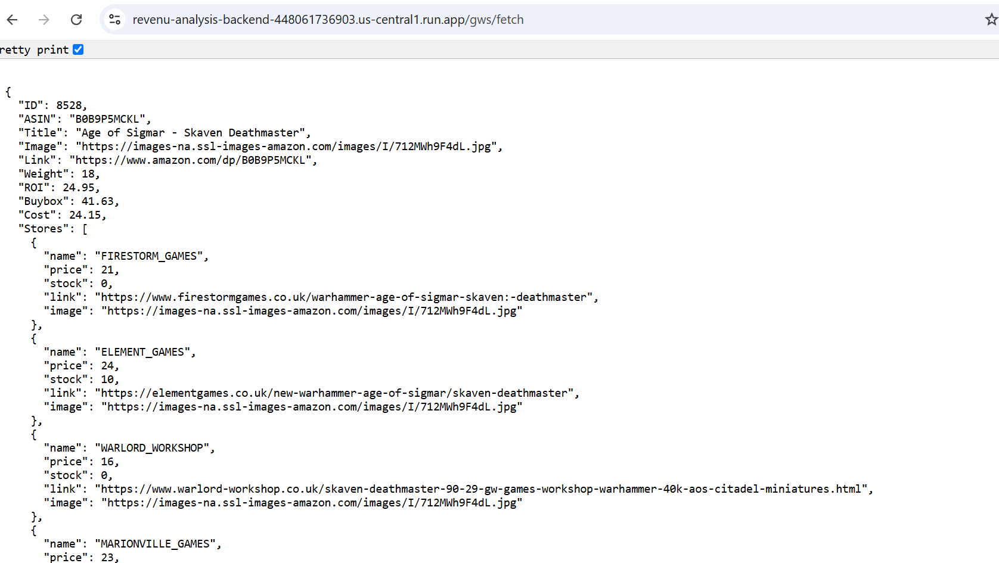
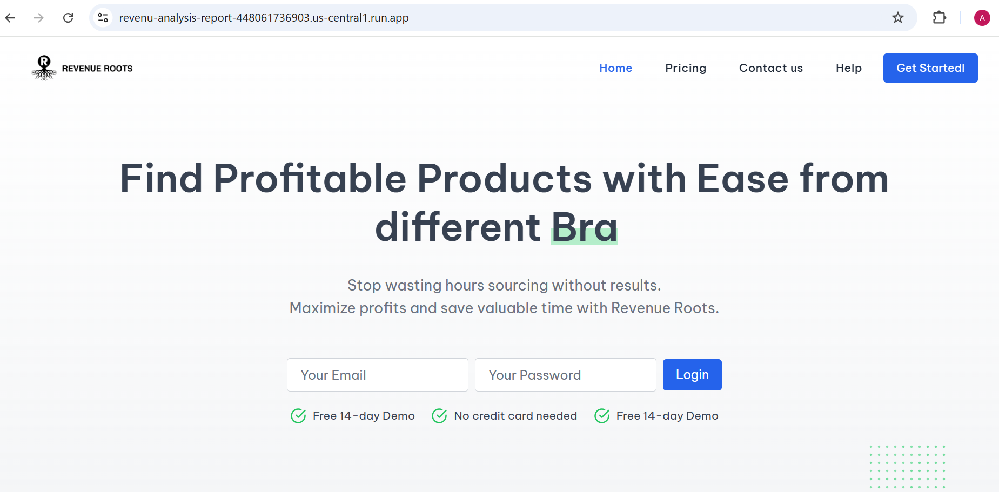

## REVENUE ROOTS

<br />


<!-- TABLE OF CONTENTS -->
<details open="open">
  <summary>Table of Contents</summary>
  <ol>
    <li>
      <a href="#about-the-project">About The Project</a>
      <ul>
        <li><a href="#built-with">Built With</a></li>
      </ul>
    </li>
    <li>
      <a href="#getting-started">Getting Started</a>
      <ul>
        <li><a href="#prerequisites">Prerequisites</a></li>
        <li><a href="#installation">Installation</a></li>
      </ul>
    </li>
    <li><a href="#usage">Usage</a></li>
    <li><a href="#roadmap">Roadmap</a></li>
    <li><a href="#contributing">Contributing</a></li>
    <li><a href="#license">License</a></li>
    <li><a href="#contact">Contact</a></li>
    <li><a href="#acknowledgements">Acknowledgements</a></li>
  </ol>
</details>

### About The Project

funonthego, a Goods buyer company with headquarter in UK, it purchase different products from amazon different market place and sells to different countries 


A list of commonly used resources that we find helpful are listed in the acknowledgements.

### Built With

Some of the Resoures that we are using in this project are :

- node js
- React js
- TypeScript
- Vite
- python
- vercel
- postgresql
- google API
- GCP
- Keepa API
- Docker Container


<!-- GETTING STARTED -->
## Getting Started

You can get a local copy up and running follow these simple example steps.

### Instraction

1. download and install docker if you want to run it locally
2. Clone the repo
   ```sh
   git clone https://github.com/abreham-g/Revenue_root.git
   ```
2. open the project in VS code.
3. open server using this command
    ```sh
    cd server
    ```
4. go to auth-services
    ```sh
    cd auth-services
    ```
5. build the Image
    ```sh
    docker build -t revenu-analysis .
    ```
6. push the image to the container
    ```sh
    docker push revenu-analysis
    ```
7. check the page in https://localhost:8080
8. Do the same for the front end and make sure to change the app.js in backend to access the frontend.


<!-- USAGE EXAMPLES -->

## BACKEND RESPONSE



## FRONTEND RESPONSE




<!-- CONTRIBUTING -->
## Contributing

Contributions are what make the open source community such an amazing place to be learn, inspire, and create. Any contributions you make are **greatly appreciated**.

1. Fork the Project
2. Create your Feature Branch (`git checkout -b feature/AmazingFeature`)
3. Commit your Changes (`git commit -m 'Add some AmazingFeature'`)
4. Push to the Branch (`git push origin feature/AmazingFeature`)
5. Open a Pull Request


<!-- LICENSE -->
## License

Distributed under the MIT License. See `LICENSE` for more information.
  
<!-- CONTACT -->
## Contributer
    Abreham Gessesse


Project Link: [https://github.com/abreham-g/Revenue_root.git)

<!-- ACKNOWLEDGEMENTS -->
## Acknowledgements

* FUNONTHEGO
